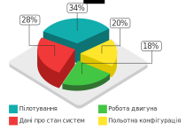

Критерії діагностики та прогнозування авіаційних комплектуючих виробів на прикладі авіаційного двигуна
=================

Оскільки основним джерелом інформації про стан ПС є засоби об'єктивного контролю, міжнародні авіаційні організації встановлюють певні вимоги до їх конструкції та даних, які вони мають накопичувати.

Одним з основних міжнародних документів, що регламентує вимоги до засобів об'єктивного контрою є додаток 6 до Конвенції про міжнародну цивільну авіацію (ICAO Annex 6).

В залежності типу повітряного судна (літак/гелікоптер) від максимальної сертифікованою злітної маси та дати видачі індивідуального посвідчення про придатність до польотів ICAO розділяє самописці на декілька типів. Аналізуючи перелік базового типу ІА можна розділити усі параметри (включаючи не обов'язкові та враховуючи багатоцільове призначення деяких) на такі типи (перелік також можна застосувати для реєстраторів типу IVA, що розроблені для вертольотів):

- польотна конфігурація;
- пілотування;
- дані про двигуни;
- дані про стан систем (крім двигунів).

Підсумовуючи загальний перелік та кількість параметрів по групам для ІА:

| Група | Кількість | Відсоток |
| :--------------------- |:------------:|:------------:|
| Польотна конфігурація | 17 | 20 |
| Пілотування  | 29 | 34 |
| Робота двигуна | 16 | 18 |
| Дані про стан систем | 24 | 28 |

Підсумовуючи загальний перелік та кількість параметрів по групам для IVA:

| Група | Кількість | Відсоток |
| :--------------------- |:------------:|:------------:|
| Польотна конфігурація | 4 | 8 |
| Пілотування  | 23 | 45 |
| Робота двигуна | 10 | 19 |
| Дані про стан систем | 14 | 28 |

Отже ICAO рекомендує реєстрацію наступного переліку даних по роботі двигуна літака:

- барометрична висота;
- приборна швидкість та індикаторна повітряна швидкість;
- тяга / потужність двигунів: тяга / потужність кожного двигуна, що витрачається на поступальний рух;
- положення важеля реверсу тяги;
- температура зовнішнього повітря;
- кут атаки;
- додаткові параметри роботи двигуна (ступінь зростання тиску, кількість обертів N1, фактичний рівень вібрації, число обертів N2, температура вихлопних газів, витрата палива, положення важеля зупинки двигуна, кількість обертів N3);
- положення клапану забору повітря;
- задана зміна тяги;
- розрахункова тяга двигуна;
- сигналізація про вібрацію кожного двигуна;
- сигналізація про граничну температуру кожного двигуна;
- сигналізація про низькій рівень мастил кожного двигуна;
- сигналізація про перевищення обертів кожного двигуна;
- положення перемикачів системи проти обмерзання постійної дії та системи проти обмерзання періодичної дії.

Причина вибору цих параметрів, як обов'язкових полягає у їх найвищій цінності при розборі авіаційної події, а отже і інформативності для діагностики та прогнозування.

Отже саме їх доцільно використовувати для діагностики та прогнозування стану цього авіаційного комплектуючого, адже розробляючи методику діагностики та прогнозування стану на основі цього переліку, можна, у деякій мірі, розраховувати на її застосовність до будь-якого ВС, який відповідає вимогам ICAO щодо оснащення засобами об'єктивного контролю.

Вибір критеріїв для діагностики та прогнозування не є тривіальним завданням і для будь-якого авіаційного комплектуючого має виконуватись індивідуально на основі моніторингу та експертної оцінки. З іншого боку збір надмірної кількості критеріїв та їх моніторинг ускладнює та здорожчує процес, тому цього теж слід уникати. При виборі параметрів та їх кількості слід керуватись принципом розумної достатності.
